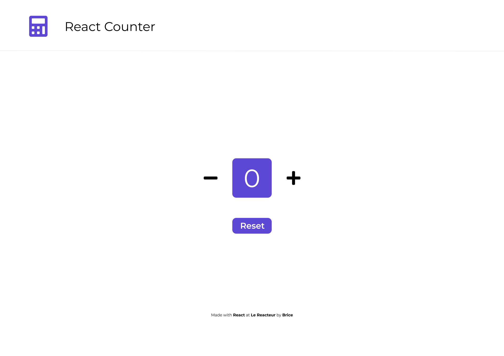

# React Counter

Site déployé ➡️ [React Counter](https://antancelin-react-counter.netlify.app/)

Nous allons commencer par manipuler les états dans React avec un exercice.

Vous devrez créer :

- un compteur avec un bouton + et un bouton -
- un bouton **'Reset'** pour remettre le compteur à zéro

 

 

## Bonus

- Faire disparaître le - quand le compteur affiche 0
- Faire disparaître le + quand le compteur affiche 10
